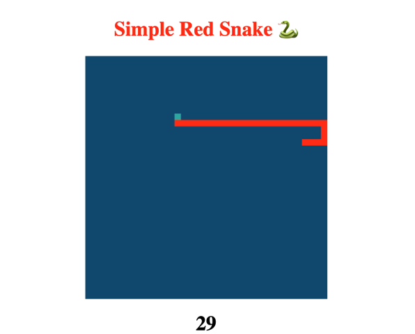

# Simple Red Snake Game - Project 1



## Contents

- [Contents](#contents)
- [Brief](#brief)
- [Approach](#approach)
- [Technologies Used](#technologies-used)
- [Code Review](code-review)
  - [HTML](#html)
  - [CSS](#css)
  - [JAVASCRIPT](#javascript)
- [Achievements and Key Learnings](#achievements-and-key-learnings
- [Conclusions](#conclusions)
- [Bugs and Challenges](#bugs-and-challenges)

## Brief
You have the chance to create a game, working through some tough programming challenges. You will be working individually on this project. Your application must render a game in the browser and design logic for game progression. Include separate HTML, CSS, JavaScript files and use Javascript for DOM manipulation (use semantic markup for HTML and CSS). The game project should also be deployed online.


## Approach
For the first General Assemmly Softare Engineering project I decided to implement the creation of the original game of Snake, while integrating my own features and style when possible. Snake is a single-player game where the player earns points by guiding the snake to eat food randomly placed on the game board. The project timeeline was 1 week in total; this involved initial planning at the beginning of the week which included solving how the user could move the snake object. This later progressed into thinking about how to increase the snake's length upon interacting with other gameboard objects. During the project I consulted documentation and researched the appropriate resources when required. I also received project feedback which I reflected and acted upon during and after the project to improve my skills further.

## Technologies Used
- HTML
- CSSS
- JAVASCRIPT

## Code Review

### HTML

The HTML code used is fairly straightforward: The title is set and the canvas height, width and background colour is configured.
``` javascript
<!DOCTYPE html>
<html>
<head>
    <title>Snake</title>
</head>
<body>
    <h1 class="main">Simple Red Snake 🐍</h1>
    <canvas class="canvas" height="380" width="380" style="background-color: #205279">
  </canvas>
    <h1 class="score"></h1>
</body>
<link rel="stylesheet" href="./main.css">
<script type="text/javascript" src="snake.js"></script>
</html>
```

### CSS

The CSS code involved the positioning and styling main game board.

``` javascript
* {
    box-sizing: border-box;
}
body {
    height: 65vh;
    display: flex;
    justify-content: center;
    align-items: center;
    flex-direction: column;
    margin: 0
}
.main {
    color: #FF2D00;
}
```

### JAVASCRIPT
- JavaScript Game Logic involved:
  - The snake should be able to move in four different directions.
  
  ```
  this.changeDirection = function(direction) {
    switch (direction) {
      case 'Up':
        this.xSpeed = 0;
        this.ySpeed = -scale * 1;
        break;
      case 'Down':
        this.xSpeed = 0;
        this.ySpeed = scale * 1;
        break;
      case 'Left':
        this.xSpeed = -scale * 1;
        this.ySpeed = 0;
        break;
      case 'Right':
        this.xSpeed = scale * 1;
        this.ySpeed = 0;
        break;
    }
  }
  
  ```
  - The snake should be able to eat 'food' blocks to grow bigger.
  
  ```
   this.eat = function(fruit) {
    if (this.x === fruit.x &&
      this.y === fruit.y) {
      this.total++;
      return true;
    }
    
  ```
  - The food should appear in random positions each time it is eaten (removed from the game board), the random method is used.
  
```
  function Fruit() {
  this.x;
  this.y;
  this.pickLocation = function() {
    this.x = (Math.floor(Math.random() *
      columns - 1) + 1) * scale;
    this.y = (Math.floor(Math.random() *
      rows - 1) + 1) * scale;
  }
  this.draw = function() {
    ctx.fillStyle = "#4cafab";
    ctx.fillRect(this.x, this.y, scale, scale)
  }
}
```
   - The detection of a collision with the snake's own body (own part of the snake length) ends and restarts the game score.
  
```
  this.checkCollision = function() {
    for (let i = 0; i < this.tail.length; i++) {
      if (this.x === this.tail[i].x &&
        this.y === this.tail[i].y) {
        this.total = 0;
        this.tail = [];
```

Link - [Referenced Code](https://github.com/RichardBekoe/Simple-Red-Snake/blob/master/snake.js)

## Achievements and Key Learnings

The skills involved included breaking the project down into different components(data, presentation, views, style, DOM manipulation) and brainstorming each component individually. I actively practiced the use Web Development Tools (console.log, inspector, alert statements, etc) to debug and solve problems. In order to implement the game logic it was important to understand all of the rules of the game. The task also helped me practice the skill of planning a project, including develivering an MVP product, before further developing extra features.

## Conclusions

I believe that I delivered a product of value to the end user. The functional game entertains a modest, simple design, allows a user to keep score and provides a straightforward goal for a user to strive towards achievement of a high score - overall establishing an attractive, fun product experience.

## Bugs and Challenges

An unintended game bug is that when the snake is moving in a certain direction, then the arrow key pressed in the opposite direction, the snake collides on itself straight away; instead this opposite key should ideally be disabled during this time.


